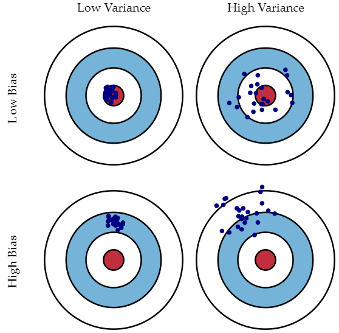
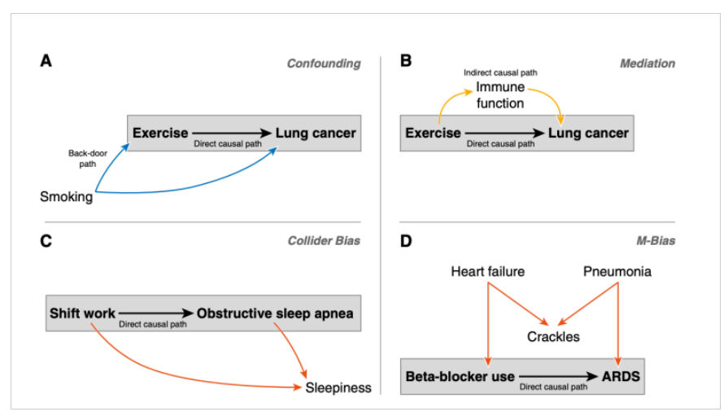

# Data Science Notebook
## 1. Core Concept
### Project Stages
---
1. Problem Formulation
2. Data Collection and Cleaning
3. Modeling and Analysis
4. Presentation and Deployment
Another popular recognized analytics model is known as **CRISP-DM**, which is short for **Cross-industry standard process for data mining**.

|  |
|:--:|
| [*Process diagram of CRISP-DM*](https://en.wikipedia.org/wiki/Cross-industry_standard_process_for_data_mining) |

### Getting Enough Right Data
---
- Understand the danger of making inference about the whole population from a small sample. 
- Pay attention to the **Law of Small Numbers**.
- Statistical Bias Types:
  - Selection bias
  - Self-selection bias
  - Recall bias
  - Observer bias
  - Survivorship bias
  - Omitted variable bias
  - Cause-effect bias
  - Cognitive bias
- Data Cleaning means using the right tools and methods to deal with the raw data after understanding the data source. 
- Ten rules for data cleaning:
  - For every result, keep track of how it was produced
  - Avoid manual data manipulation steps
  - Archive the exact versions of all external programs used
  - Version control all custom scripts
  - Record all intermediate results, when possible in standardized formats
  - For analyses that include randomness, note underlying random seeds
  - Always store raw data behind plots
  - Generate hierarchical analysis output, allowing layers of increasing detail to be inspected
  - Connect textual statements to underlying results
  - Provide public access to scripts, runs, and results

### Overfitting
---
- **Overfitting** means the model doesn't perform well on unseen data, which is a common problem in machine learning. 
- **Signal**, the true underlying pattern, is what we want the algorithm to learn from the training data. However, **Noise**, the irrelevant information in the dataset can lead to overfitting after learned by the algorithm.
- The trade-off between high bias vs high variance should be considered for all supervised learning algorithms.

|  |
|:--:|
| [*Bias and Variance*](http://scott.fortmann-roe.com/docs/BiasVariance.html) |

- **Cross-validation** is a useful tool against overfitting. The other tools include **Feature selection**, **Early stopping**, **Regularization**, etc.

### Causality
---
- Correlation is not causation
- **p-hacking**,also known as data dredgin or data snooping, is about testing multiple hypotheses using the same data, which increasing the risk of false positive.
- **Simpson's Paradox** could be resolved by conditioning on the third variable. 
- **Confounders**, **Mediators**, **Colliders**, **M-bias**

|  |
|:--:|
| [*DAGs, visualising Confounding, Mediation, Collider and M-Bias*](https://theoreticalecology.wordpress.com/2019/04/14/mediators-confounders-colliders-a-crash-course-in-causal-inference/) |

### Story Telling
---
- Data can't speak for itself. If the insights are crutial to the success, data scientist have the duty to communicate them clearly in a timely manner.
- Know your audience. Even though logic and insights are important, decision making is more likely to be triggered by emotion.
- A picture is worth a thousand words.
- Accuracy is not enough. Interpretability is vital for machine learning.

### Reference
---
- Books & Papers

Book/Paper | Author(s) | Year
--- | --- | ---
[Data Scientists at Work](./Assets/reference/Data%20Scientists%20at%20Work%20(Sebastian%20Gutierrez).pdf) | Sebastian Gutierrez | 2014
[Data Science for Business](./Assets/reference/Data%20Science%20for%20Business%20What%20You%20Need%20to%20Know%20About%20Data%20Mining%20and%20Data-Analytic%20Thinking%20by%20Foster%20Provost%2C%20Tom%20Fawcett.pdf) | Foster Provost & Tom Fawcett | 2013
[What Data Scientists Really Do](https://hbr.org/2018/08/what-data-scientists-really-do-according-to-35-data-scientists) | Hugo Bowne-Anderson | 2018
[The Gambler's Fallacy and The Law of Small Numbers](https://bjlkeng.github.io/posts/gamblers-fallacy-and-the-law-of-small-numbers/) | Brian Keng | 2015
[Thinking Fast and Slow](./Assets/reference/Thinking%2C%20Fast%20and%20Slow.pdf) | Daniel Kahneman | 2011
[Statistical Bias Types explained](https://data36.com/statistical-bias-types-explained/) | Tomi Mester | 2022
[Data Cleaning 101](https://towardsdatascience.com/data-cleaning-101-948d22a92e4) | Brendan Bailey | 2017
[10 Rules for creating reproducible results in data science](https://dataconomy.com/2017/07/10-rules-results-data-science/) | Andrew Tait | 2017
[Data cleansing](https://en.wikipedia.org/wiki/Data_cleansing) | Wikipedia | - 
[Overfitting in Machine Learning](https://elitedatascience.com/overfitting-in-machine-learning) | ELITEDS | 2022
[Improve Your Model Performance using Cross Validation](https://www.analyticsvidhya.com/blog/2018/05/improve-model-performance-cross-validation-in-python-r/) | Sunil Ray | 2020
[Spurious correlations](https://tylervigen.com/spurious-correlations) | Tyler Vigen | - 
[p-Hacking and Multiple Comparisons Bias](https://www.quantrocket.com/codeload/quant-finance-lectures/quant_finance_lectures/Lecture23-p-Hacking-and-Multiple-Comparisons-Bias.ipynb.html) | QuantRocket | -

- Multimedia Sources
  - [DataFramed](https://www.datacamp.com/podcast)
 

## 2. Deep Learning

- [Convolutional Networks](https://www.deeplearningbook.org/contents/convnets.html)
- [CS231n Convolutional Neural Networks for Visual Recognition](https://cs231n.github.io/convolutional-networks/)

### Reference
---
- Books & Papers

Book/Paper | Author(s) | Year
--- | --- | ---
[An overview of gradient descent optimization](https://ruder.io/optimizing-gradient-descent/) | Sebastian Ruder | 2016
[Neural Networks and Deep Learning](http://neuralnetworksanddeeplearning.com/chap1.html) | Michael Nielsen | 2019
[A Step by Step Backpropagation Example](https://mattmazur.com/2015/03/17/a-step-by-step-backpropagation-example/) | Matt Mazur | 2015

